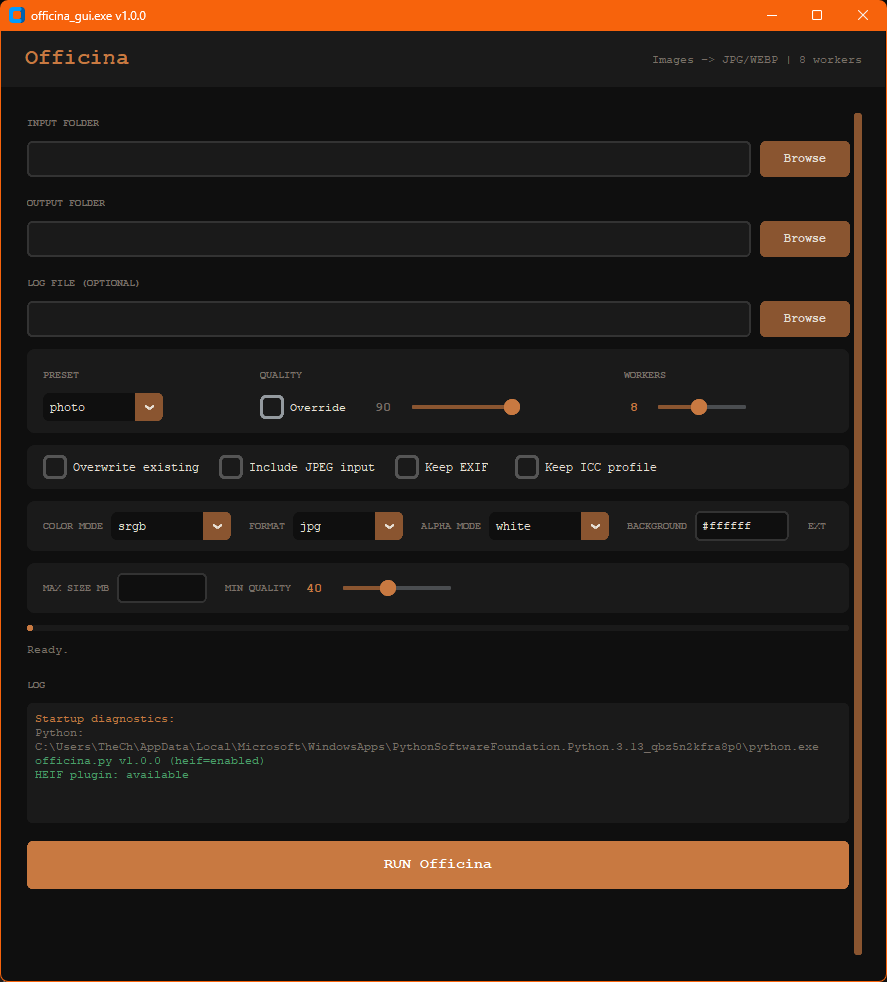

# officina

`officina.py` converts images to `.jpg` or `.webp` in parallel.
`officina_gui.py` provides a desktop GUI for the same workflow.

## Features

- Multiprocessing conversion (`8` workers by default)
- Preserves input folder structure in output
- Skips up-to-date files using modified-time checks
- Optional overwrite mode
- Progress output and final summary
- Logs failures and run summary to a log file
- Optional HEIF/HEIC input support
- ICC-aware color handling (`srgb` or `preserve`)
- Metadata controls for EXIF and ICC
- Alpha handling modes for transparent images
- JPEG/WebP quality presets (`web`, `photo`, `archive`)
- Optional JPEG input re-encoding (`--include-jpeg`)
- Optional max-size targeting with adaptive quality (`--max-size-mb`)

## Requirements

- Python 3.8+
- Pillow
- customtkinter (for GUI)
- Optional: `pillow-heif` for `.heic`/`.heif` input

Install core dependencies:

```bash
pip install pillow customtkinter
```

Install optional HEIF support:

```bash
pip install pillow-heif
```

## Usage

Run from project root with defaults (input = script folder, output = `<input>/jpg`, workers = `8`, preset = `photo`):

```bash
python .\Officina\officina.py
```

Common options:

```bash
python .\Officina\officina.py --input "C:\path\to\images" --output "C:\path\to\jpgs" --workers 8 --preset photo --quality 90 --color-mode srgb --keep-icc --log-file "C:\path\to\run.log"
```

Overwrite existing JPG files:

```bash
python .\Officina\officina.py --overwrite
```

Include only specific extensions:

```bash
python .\Officina\officina.py --ext .png --ext .heic --ext .heif
```

Scan only the top-level input folder (non-recursive):

```bash
python .\Officina\officina.py --non-recursive
```

Include JPEG inputs:

```bash
python .\Officina\officina.py --include-jpeg
```

Target a max output size:

```bash
python .\Officina\officina.py --max-size-mb 2.0 --min-quality 40
```

Output as WebP instead of JPG:

```bash
python .\Officina\officina.py --output-format webp
```

Preserve metadata and fail on alpha:

```bash
python .\Officina\officina.py --keep-exif --keep-icc --alpha-mode error
```

Use custom background color when flattening alpha:

```bash
python .\Officina\officina.py --alpha-mode background --background "#f5f5f5"
```

Show help:

```bash
python .\Officina\officina.py --help
```

Show version:

```bash
python .\Officina\officina.py --version
```

If you run commands from inside the `Officina` folder, you can use `python officina.py ...`.

## GUI Usage

Launch the GUI:

```bash
python .\Officina\officina_gui.py
```



GUI notes:

- Uses `customtkinter` with a dark theme.
- Exposes preset/quality/workers, output format, overwrite, EXIF/ICC, color mode, alpha mode, extensions, and log file path.
- Executes the CLI script in the background and streams live log/progress.
- Runs startup diagnostics in the log panel (CLI version + HEIF plugin status).
- Updates title bar with detected build version (`officina_gui.exe vX.Y.Z`).

## CLI Arguments

- `--input`: Input folder to scan for files
- `--output`: Output folder for converted files
- `--workers`: Number of worker processes (default: `8`)
- `--preset`: Output preset: `web`, `photo`, `archive` (default: `photo`)
- `--quality`: JPEG quality `1-95` (default from selected preset)
- `--output-format`: Output format: `jpg` or `webp` (default: `jpg`)
- `--min-quality`: Minimum JPEG quality floor used by size-capping (default: `40`)
- `--max-size-mb`: Target max output size per image in MB (optional)
- `--overwrite`: Reconvert even if destination is up to date
- `--recursive`: Scan input folders recursively (default behavior)
- `--non-recursive`: Scan only the top level of the input folder
- `--include-jpeg`: Allow processing `.jpg/.jpeg` inputs
- `--log-file`: Log file path (default: timestamped file in output folder)
- `--ext`: Input extension filter; repeatable (default: `.png`, `.heic`, `.heif`)
- `--color-mode`: Color handling: `srgb` or `preserve` (default: `srgb`)
- `--keep-exif`: Preserve EXIF metadata in output file
- `--keep-icc`: Embed ICC profile in output file
- `--alpha-mode`: Transparency flattening: `white`, `black`, `checker`, `background`, `error` (default: `white`)
- `--background`: Background color for `--alpha-mode background` (default: `#ffffff`)
- `--version`: Print version and HEIF support status

## Notes

- HEIF input requires `pillow-heif`. If missing, `.heic` and `.heif` files are skipped with a warning.
- Output uses `.jpg` or `.webp` depending on `--output-format`, preserving relative subfolder structure from input.
