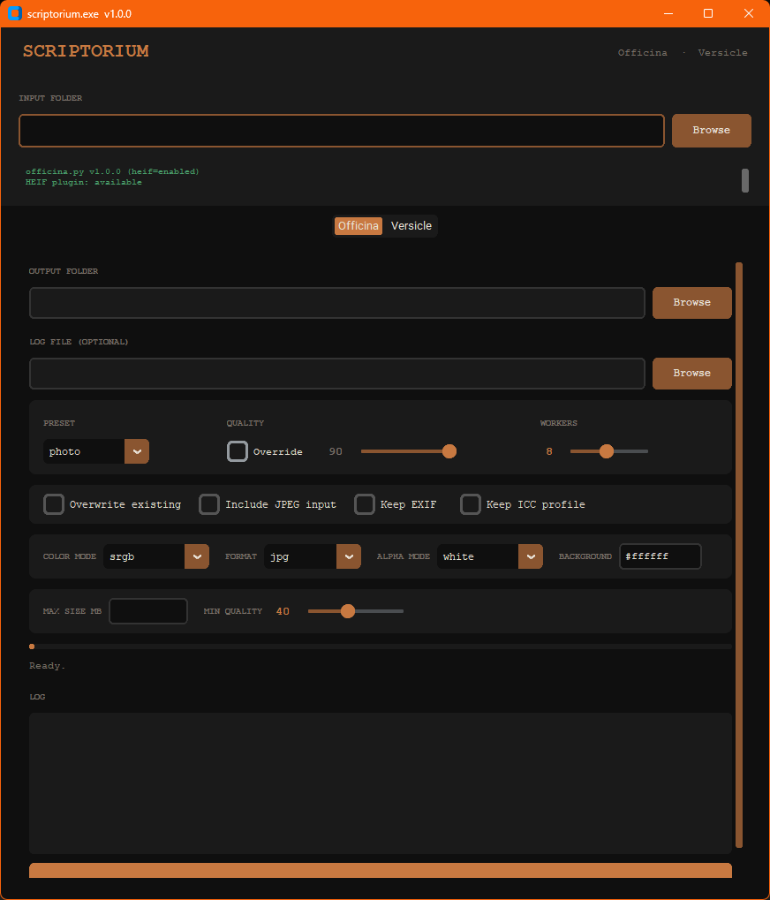
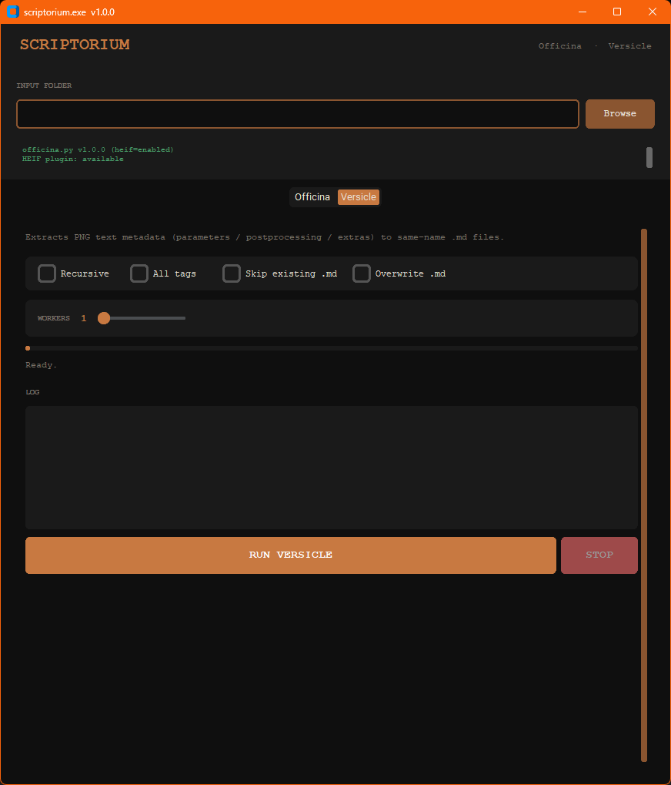

# scriptorium

`scriptorium_gui.py` is a unified desktop GUI for:

- Officina (image conversion to `.jpg` or `.webp`)
- Versicle (PNG metadata extraction to `.md` sidecars)

## Requirements

- Python 3.8+
- customtkinter
- Pillow
- Optional: `pillow-heif` for HEIF/HEIC support in Officina workflows

Install dependencies:

```bash
pip install customtkinter pillow
```

Optional HEIF support:

```bash
pip install pillow-heif
```

## Usage

Launch from project root:

```bash
python .\Scriptorium\scriptorium_gui.py
```

If you run commands from inside the `Scriptorium` folder, you can use `python scriptorium_gui.py`.

### Screenshots

Officina tab:



Versicle tab:



## What It Does

- Provides one shared input folder for both tools.
- Includes two tabs:
- `Officina`: exposes conversion settings (including dry-run) and runs `officina.py` in the background.
- `Versicle`: extracts metadata to same-name Markdown files with optional recursion/workers and live progress updates.
- Shows startup diagnostics (version and optional HEIF plugin availability).

## Notes

- `Scriptorium` expects `officina.py` and `versicle.py` to be discoverable from the repo layout.
- `--officina-cli` is an internal packaged-build forwarding flag used by `scriptorium_gui.py`; it is not intended as a public user-facing CLI.
