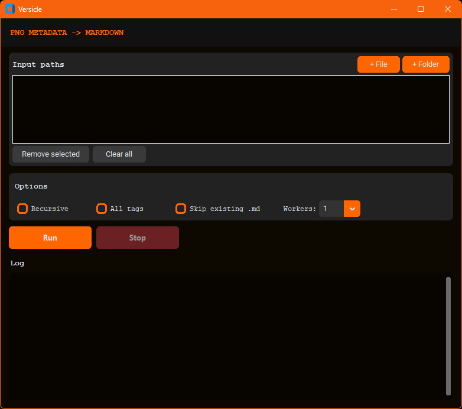

# versicle

`versicle.py` extracts PNG text metadata into same-name Markdown sidecar files.
`versicle_gui.py` provides a desktop GUI for the same workflow.

## What It Extracts

By default, these PNG metadata keys are written to `.md` files if present:

- `parameters`
- `postprocessing`
- `extras`

Use `--all-tags` to write every discovered metadata key instead.

These keys are commonly embedded by AI image generation workflows (for example, Stable Diffusion UIs) and store prompt/settings metadata inside PNG text chunks.

## Requirements

- Python 3.8+
- For GUI: `customtkinter`

Install GUI dependency:

```bash
pip install customtkinter
```

## CLI Usage

Run from project root (current directory):

```bash
python .\Versicle\versicle.py
```

Process one folder recursively:

```bash
python .\Versicle\versicle.py "C:\path\to\pngs" --recursive
```

Use all metadata tags and multiple workers:

```bash
python .\Versicle\versicle.py "C:\path\to\pngs" --all-tags --workers 8 --recursive
```

Skip files that already have sidecar `.md` files:

```bash
python .\Versicle\versicle.py "C:\path\to\pngs" --skip-existing --recursive
```

If you run commands from inside the `Versicle` folder, you can use `python versicle.py ...`.

## GUI Usage

Launch GUI:

```bash
python .\Versicle\versicle_gui.py
```



GUI notes:

- Add folders/files to input list.
- Supports recursive mode, all-tags mode, skip-existing mode, and worker count.
- Streams run output to the log panel.
- Shows a live progress bar during processing.

## CLI Arguments

- `paths`: PNG files or directories (default: current directory)
- `--all-tags`: Write all discovered metadata tags
- `--recursive`: Walk subdirectories for directory inputs
- `--workers`: Number of worker processes (default: `1`)
- `--overwrite`: Overwrite existing sidecar `.md` files
- `--skip-existing`: Skip PNGs with existing sidecar `.md` files
